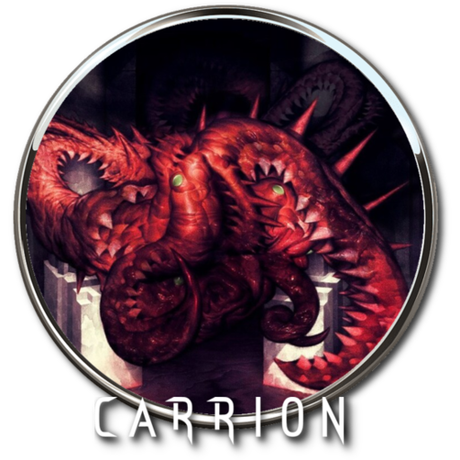

## Aprendendo Programação e percebendo que a REALIDADE É BRUTAL!

---

### ✨ Curiosidades
- 📖 Aprendendo A Codar pelos MELHORES professores do SENAI
- 🚀 Tenho Projetos sendo feitos por curiosidade e desenvolvimento Pessoal
- 👤 Tenho um amigo (esquisito) fazendo o mesmo curso (Yan-TheEGGMAN)
- 🎲 Gosto de RPG e Games

### 💎 Platinas

 Platinei Enigma Do Medo

 Platinei Carrion

 "Platinei" Hollow Knight (Falta o Panteão)

 "Platinei" Holllow Knight Silksong (Falta o Boss Final Verdadeiro)

 "Platinei" Dreadge (Falta algumas coisas)

 Platinarei Dave The Diver (Irei Platinar)

  
---

### 🌐 Linguagens

---

### ⚡ Frameworks

---

### 🛠️ Tecnologias

